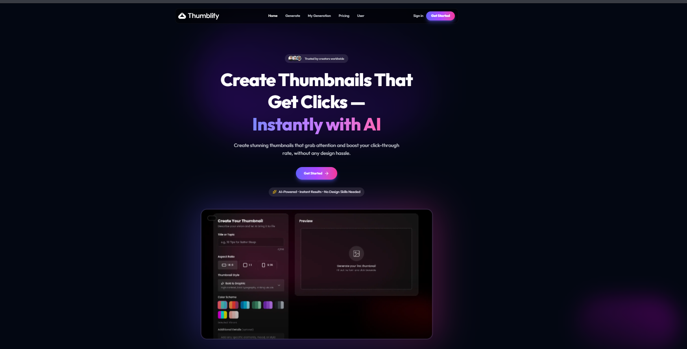
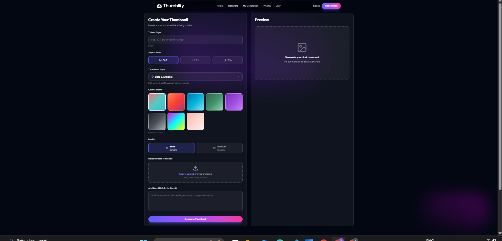
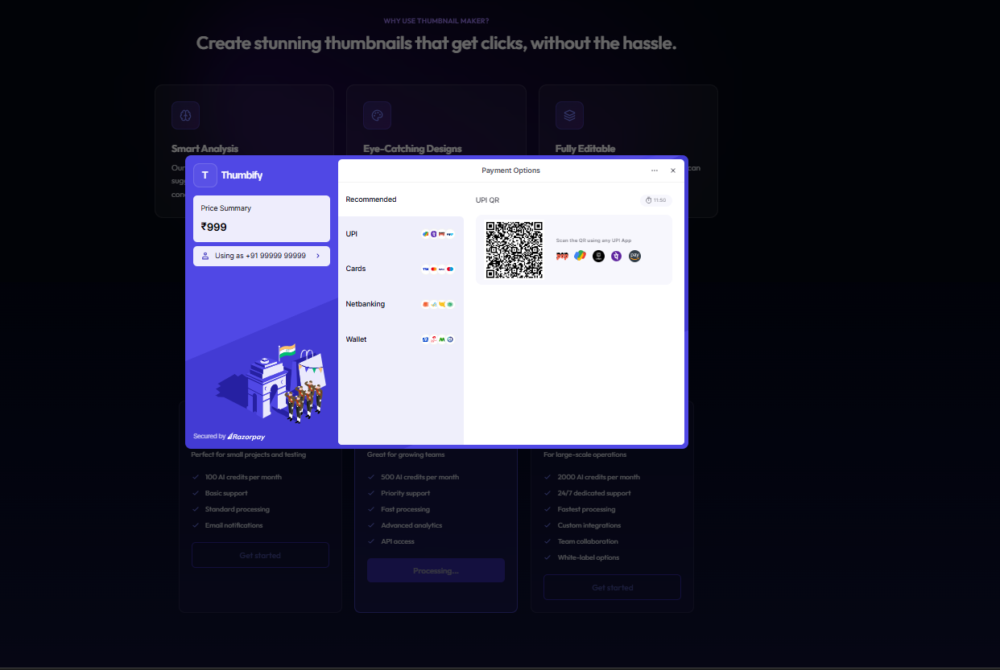

# Thumblify 🚀

**AI-powered YouTube thumbnail generator that helps creators design eye-catching thumbnails with ease.**

---

## 📖 Description

Thumblify revolutionizes the way content creators design YouTube thumbnails by harnessing the power of artificial intelligence. Say goodbye to hours spent in design software and hello to professional, attention-grabbing thumbnails generated in seconds.

Whether you're a beginner YouTuber or an established content creator, Thumblify makes thumbnail creation effortless. Simply describe your vision, choose your quality tier, and let our AI do the heavy lifting. With Pollination AI integration, every thumbnail is crafted to maximize click-through rates and viewer engagement.

## ✨ Features

- **🤖 AI-Powered Generation**: Leverages Pollination AI to create high-quality YouTube thumbnails.
- **💎 Two Tier System**: 
  - **Basic Thumbnails**: 5 credits per generation.
  - **Premium Thumbnails**: 10 credits per generation.
- **🎁 Free Credits**: Every new user receives **30 free credits** upon signing up.
- **💳 Razorpay Integration**: Seamless and secure payment processing for credit top-ups.
- **🔐 Google OAuth**: Fast and secure authentication using your Google account.
- **📊 Credit Management**: Real-time tracking of your remaining thumbnail credits.

---

## 🖼️ Screenshots

### Homepage

*Create stunning thumbnails that get clicks - instantly with AI*

### Thumbnail Generator

*Intuitive interface to create your custom thumbnails with various styles*

### Payment Integration

*Secure payment processing with multiple options via Razorpay*

### Generated Thumbnails Gallery

*View and manage all your previously generated thumbnails*

---

## 🛠️ Tech Stack

- **Frontend**: React.js / Next.js
- **Backend**: Node.js / Express
- **Database**: MongoDB / PostgreSQL (via `DATABASE_URL`)
- **AI Integration**: Pollination AI
- **Payment Gateway**: Razorpay
- **Authentication**: Google OAuth 2.0

---

## 🚀 Getting Started

### Prerequisites

- Node.js (v14 or higher)
- npm or yarn
- Google Cloud Console credentials (OAuth)
- Razorpay API keys
- Pollination AI API key

### Installation

1. **Clone the repository**
   ```bash
   git clone [https://github.com/yourusername/thumblify.git](https://github.com/yourusername/thumblify.git)
   cd thumblify
